<!-- The artwork in assets/ (desktop) and assets/mobile/ (phones, swapped in under 600px) is generated by
     tools/build.py from happyin.work's design tokens. Change the script and rebuild; do not hand-edit the SVGs.
     A <picture> cannot carry a link on GitHub (it pulls the  out of a linked <picture>), so the
     project cards, which must link, are plain images; panels that swap for phones are unlinked. -->

<picture>
  <source media="(max-width: 600px)" srcset="assets/mobile/header.svg">
  
</picture>

 

I build **turnkey image-processing pipelines for businesses**: from a folder of your real images to a pipeline
running on GPUs. ML engineer specialising in **diffusion models and image processing**: generative AI, computer
vision, [ComfyUI](https://happyin.work/comfyui/) and Diffusers stacks. At Glam.ai I shipped AI features to
**4M+ users** and ran an **80-GPU H200 cluster**. I use AI coding agents as a development tool, and open-sourced
the tooling I needed to make them work in a team.

 

<a href="https://happyin.work/glam/">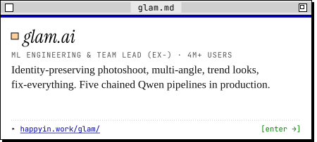</a><a href="https://happyin.work/mashinki/">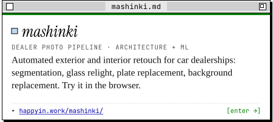</a><a href="https://happyin.work/happyin-ai/">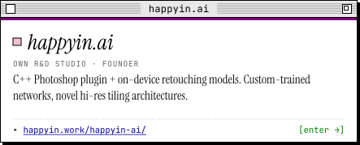</a><a href="https://happyin.work/ois-gold/">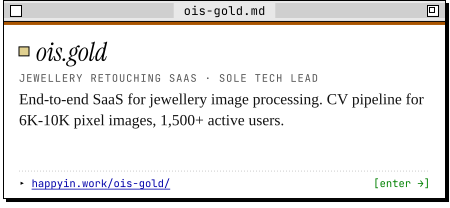</a>

 

<picture>
  <source media="(max-width: 600px)" srcset="assets/mobile/open-source.svg">
  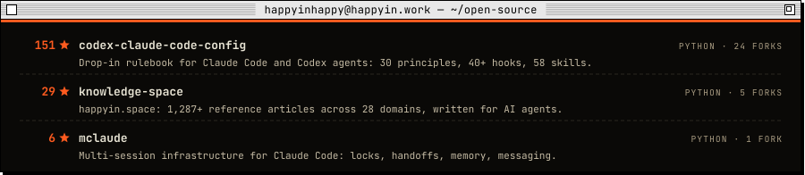
</picture>

 

<picture>
  <source media="(max-width: 600px)" srcset="assets/mobile/production-log.svg">
  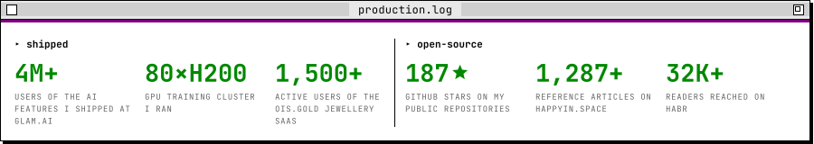
</picture>

 

<picture>
  <source media="(max-width: 600px)" srcset="assets/mobile/stack.svg">
  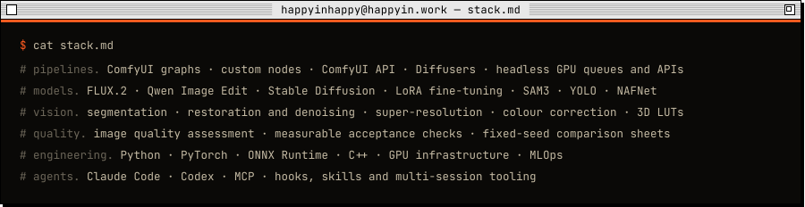
</picture>

 

<picture>
  <source media="(max-width: 600px)" srcset="assets/mobile/as-featured.svg">
  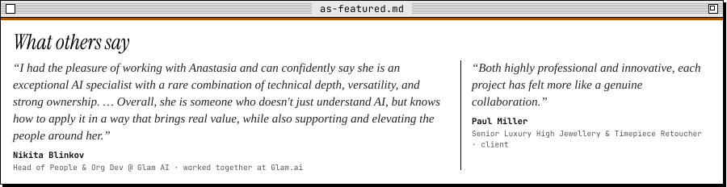
</picture>

Recommendations on [LinkedIn](https://www.linkedin.com/in/happyinhappy/) · interview:
[AI Talks: Anastasia — OIS.AI retouch](https://plainai.tech/articles/ai-talks-anastasia-ois-ai-retouch-interview) (Plain AI)

 

 <a href="https://happyin.space/">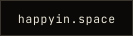</a> <a href="https://www.linkedin.com/in/happyinhappy/">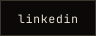</a> <a href="https://t.me/happy_in_happy">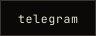</a> <a href="https://habr.com/ru/users/Sonia_Black/">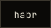</a>

 

<picture>
  <source media="(max-width: 600px)" srcset="assets/mobile/taskbar.svg">
  
</picture>

