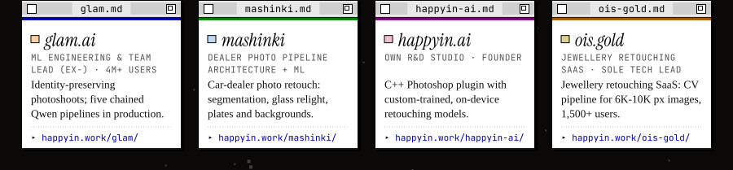

<!-- The artwork in assets/ (desktop) and assets/mobile/ (phones, swapped in under 600px) is generated by
     tools/build.py from happyin.work's design tokens, the copy in tools/happyin-copy.json and the
     happyin.space numbers in tools/kb-stats.json (refreshed by tools/kb_stats.py). Rebuild; do not hand-edit.
     The images float (align="left") so they stack with no gap and their skies join into one. -->

<a href="https://happyin.work/"><picture><source media="(max-width: 600px)" srcset="assets/mobile/header.svg"></picture></a><a href="https://happyin.work/"><picture><source media="(max-width: 600px)" srcset="assets/mobile/happyin-projects.svg"></picture></a><a href="https://happyin.space/"><picture><source media="(max-width: 600px)" srcset="assets/mobile/knowledge-base.svg"></picture></a><a href="https://huggingface.co/happyinhappy"><picture><source media="(max-width: 600px)" srcset="assets/mobile/stack.svg"></picture></a>
